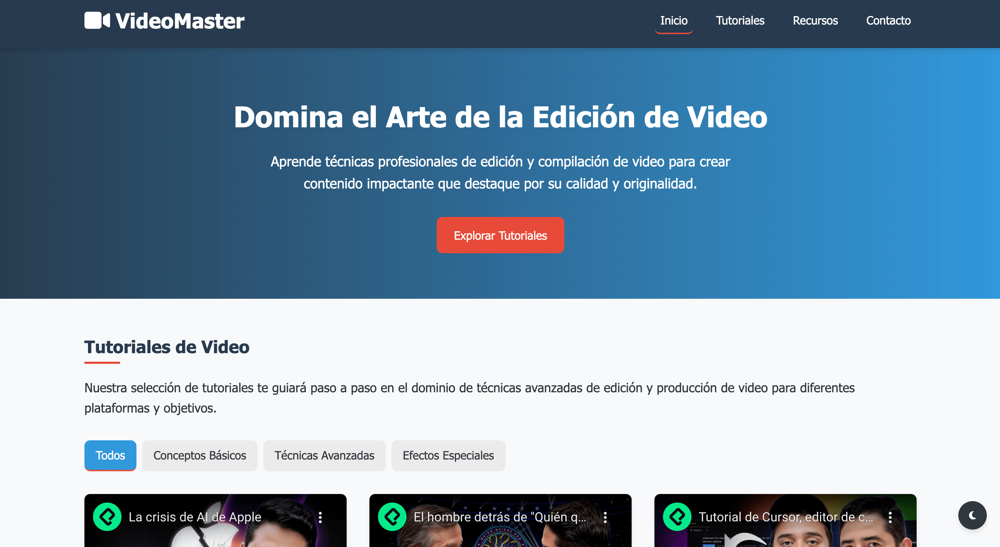

# VideoMaster - Portal de Aprendizaje Audiovisual

## Tabla de contenidos

- [Resumen](#resumen)
  - [El reto](#el-reto)
  - [Capturas de pantalla](#capturas-de-pantalla)
  - [Enlaces](#enlaces)
- [Mi proceso](#mi-proceso)
  - [Construido con](#construido-con)
  - [Lo que aprendí](#lo-que-aprendí)
  - [Desarrollo continuo](#desarrollo-continuo)
  - [Recursos útiles](#recursos-útiles)
- [Autor](#autor)
- [Agradecimientos](#agradecimientos)

## Resumen

### El reto

Los usuarios deberían poder:

- Ver tutoriales de video organizados en una interfaz intuitiva y responsiva
- Filtrar los videos por categorías (Conceptos Básicos, Técnicas Avanzadas, Efectos Especiales)
- Acceder a recursos adicionales relacionados con la edición de video
- Contactar a través de un formulario para consultas o proyectos personalizados
- Alternar entre modo claro y oscuro según sus preferencias
- Navegar cómodamente tanto en dispositivos móviles como en escritorio

### Capturas de pantalla



### Enlaces

- URL de la solución: [URL GITHUB](https://github.com/jorge-maikel-sierra/video-compilation-page)
- URL del sitio en directo: [URL PRODUCCION](https://jorge-maikel-sierra.github.io/video-compilation-page/)

## Mi proceso

### Construido con

- HTML5 semántico
- CSS personalizado con variables
- Flexbox y CSS Grid
- Diseño mobile-first
- JavaScript para interactividad
- Font Awesome para iconografía
- Técnicas de diseño responsivo

### Lo que aprendí

Durante este proyecto, adquirí varios conocimientos importantes que me gustaría destacar:

- **Implementación del tema oscuro**: Logré implementar un sistema de cambio de tema utilizando CSS variables y localStorage para persistencia.

```css
:root {
    --color-primary: #3498db;
    --color-secondary: #2c3e50;
    --color-accent: #e74c3c;
    --color-light: #f8f9fa;
    --color-dark: #343a40;
    --shadow: 0 4px 6px rgba(0, 0, 0, 0.1);
    --radius: 8px;
    --transition: all 0.3s ease;
}
```

- **Sistema de filtrado por categorías**: Implementé filtros dinámicos para mostrar videos por categoría.

```javascript
filterTabs.forEach(tab => {
    tab.addEventListener('click', () => {
        // Remover clase activa de todos los tabs
        filterTabs.forEach(item => item.classList.remove('active'));
        // Añadir clase activa al tab clickeado
        tab.classList.add('active');
        
        const filterValue = tab.getAttribute('data-filter');
        
        videoCards.forEach(card => {
            if (filterValue === 'all' || card.getAttribute('data-category') === filterValue) {
                card.style.display = 'block';
            } else {
                card.style.display = 'none';
            }
        });
    });
});
```

- **Navegación suave con anchors**: Mejoré la experiencia de usuario con navegación suave entre secciones.

```javascript
document.querySelectorAll('a[href^="#"]').forEach(anchor => {
    anchor.addEventListener('click', function(e) {
        e.preventDefault();
        
        const targetId = this.getAttribute('href');
        if (targetId === '#') return;
        
        const targetElement = document.querySelector(targetId);
        
        window.scrollTo({
            top: targetElement.offsetTop - 100,
            behavior: 'smooth'
        });
        
        // Cerrar menú móvil al hacer clic en un enlace
        navMenu.classList.remove('active');
    });
});
```

### Desarrollo continuo

Quiero seguir profundizando en el desarrollo frontend, especialmente en JavaScript y frameworks modernos. Aunque he logrado crear una interfaz responsiva e interactiva, hay técnicas avanzadas como lazy loading para los videos, animaciones más sofisticadas y optimización de rendimiento que me gustaría implementar en futuras versiones del proyecto.

### Recursos útiles

- [MDN Web Docs](https://developer.mozilla.org/es/) - Documentación completa que me ayudó a comprender conceptos avanzados de CSS y JavaScript.
- [CSS-Tricks](https://css-tricks.com/) - Excelentes tutoriales sobre Grid, Flexbox y técnicas modernas de CSS.
- [Font Awesome](https://fontawesome.com/) - Biblioteca de iconos que enriqueció la interfaz visual del proyecto.

## Autor

- GitHub - [@jorge-maikel-sierra](https://github.com/jorge-maikel-sierra)
- Twitter - [@Jorge_Sierra_1](https://x.com/Jorge_Sierra_1)

## Agradecimientos

Quiero agradecer a mi familia, especialmente a mi mujer Rosa y a mis cinco hijos, por su amor, apoyo incondicional y paciencia durante este proyecto. Su motivación constante ha sido fundamental para alcanzar mis metas. También quiero agradecer a todos los creadores de contenido educativo sobre desarrollo web que han compartido sus conocimientos y han sido una fuente constante de inspiración. Finalmente, agradezco a la comunidad de desarrolladores que siempre está dispuesta a ayudar y compartir soluciones a problemas comunes.